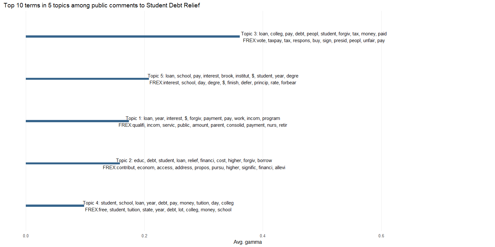
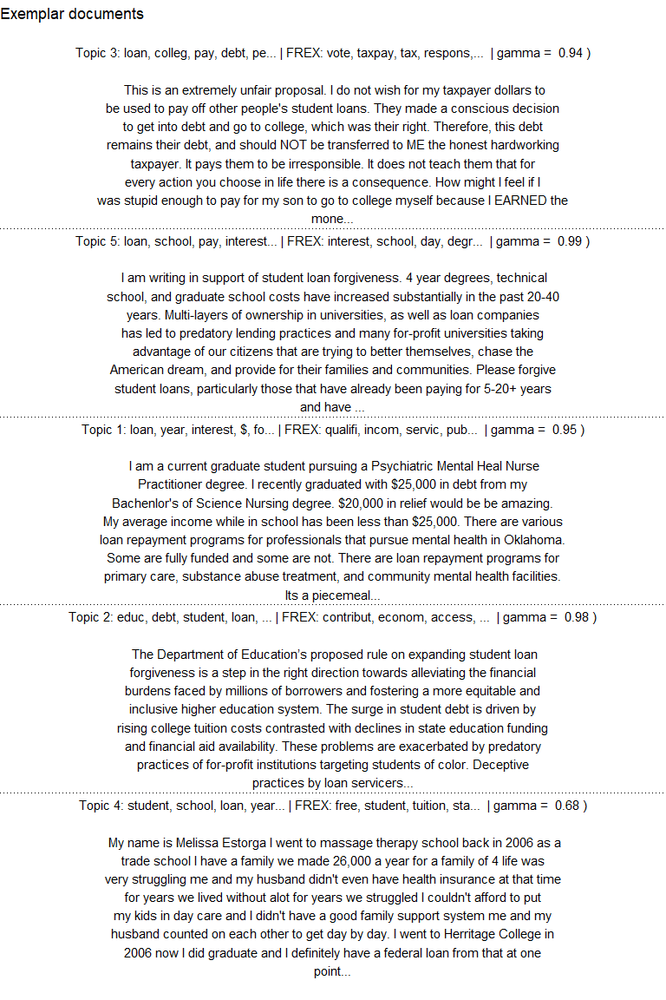
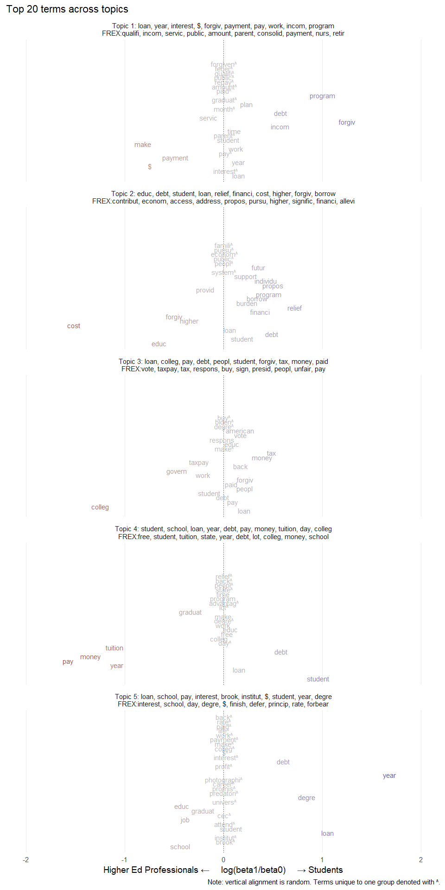

## Introduction
Structural Topic Modelling ([STM](https://cran.r-project.org/web/packages/stm/index.html)) is a topic modelling technique similar to LDA that allows characteristics of the author ("metadata") to influence the topical prevalence, content, or both. I use recent public available data from [public commentary](https://www.regulations.gov/document/ED-2023-OPE-0123-26398) about proposed student debt relief as an example. Comments could be submitted between between April 17th and May 17th 2024, and were retrieved by [request](https://www.regulations.gov/bulkdownload). Comments are public and people are encouraged not to share too much personal information, but some still do.

## Data
Data were delivered via email in a CSV file. Importing is straightforward:  standardizing names and dropping those variables missing all cases.

```r
pub_com <- read_csv(dir("data", pattern = "csv", full.names = TRUE), 
                    guess_max = 2000, 
                    show_col_types = FALSE) |> 
  rename_with(tolower) |> 
  rename_with(str_replace_all, pattern = " ", replacement = "_") |> 
  select( -where(\(x) all(is.na(x)))) |> 
  select(-first_name, last_name)
```

A brief sampling of comments:

```r
paste(1:5, ":" , str_trunc(pub_com[sample(nrow(pub_com), 5), ]$comment, 300)) |> 
  cat(sep = "\n\n")
```

```
## 1 : President Biden has no authority to set his own rules with the Secretary of Education that have not been given to the congress of the U.S. for their approval and their comments and or agreement or disagreement.  The president is a waste of a human being and his dimentia is getting worse.  He is s...
## 
## 2 : If you can’t cancel the loans cancel the interest. Let us loan borrowers actually put our money back into the economy and not be stuck paying loans off for the rest of our lives. 
## Money is being spent on everyone else outside of this country so how is there not enough to cancel a good portion of ...
## 
## 3 : I believe this does not go far enough as it does not address the elderly parents that have taken out student loans for their children's education. If the student has graduated over ten years ago and the parent is eligible for social security, that is putting an undue burden on the parent, especia...
## 
## 4 : The president of the United States is NOT to capriciously spend taxpayer money to cancel student loans - it is prohibited by the Constitution.  I would suggest that the current president read the Constitution and adhere to his oath of office (and not just as related to cancelling student loans). ...
## 
## 5 : It has been said that those with a college degree earn 1 million dollars over their careers of those that do not have a degree. Why do those of us without college degrees need to pay back the more affluent college degree citizens? When I apply for loans, I pay them back, I'd like to think that if...
```

There are 5,997 submitted comments ranging from April 22, 2024 to May 20, 2024 per the data, so presumably there is some approval process or delay before comments are posted to the docket.  

Perusing the data suggest that the `category` field might be worth using as the author metadata in the model. It describes and (presumably) is submitted by the author through some form. (This is the first time I have used these data and have not looked deeply into the collection process). About a quarter of submissions have no `category` label, one in seven are "other", one in ten are labelled as "individual", "loans servicers," and "student", among other things.  I collapse "Institution of Higher Education", "Four-Year Public", and "Private/For-Profit" institutions into the first because the distinctions are not useful in this example, in addition to being ambiguous (i.e., does "Private/For-Profit" also include 2-year institutions? What about 2-year public institutions?).


```r
pub_com <- mutate(
  pub_com, 
  category = replace_na(category, "(Missing)") |> 
    factor() |> 
    fct_lump_prop(prop = .01, other_level = "All other") |> 
    fct_recode("Institution of Higher Education"  = 
                 "Four-Year Public Institution of Higher Education", 
               "Institution of Higher Education" = 
                 "Private/For-Profit Institution of Higher Education")
)

count(pub_com, category, sort = TRUE) |> 
  mutate(p = n / sum(n) * 100) |> 
  kable(digits = 2)
```


|category                         |    n|     p|
|:--------------------------------|----:|-----:|
|(Missing)                        | 1590| 26.51|
|Other                            |  859| 14.32|
|Individual                       |  621| 10.36|
|Institutional and Loan Servicers |  621| 10.36|
|Student                          |  554|  9.24|
|Institution of Higher Education  |  519|  8.65|
|All other                        |  481|  8.02|
|Financial Aid Administrator      |  335|  5.59|
|Federal Agency                   |  213|  3.55|
|Congress                         |  117|  1.95|
|Parent/Relative                  |   87|  1.45|

There are a few other variables that would be interesting were they not largely missing, like `government_agency` or `organization_name`.

## Structural Topic Modelling
For the sake of example, suppose I am interested in whether students and people working in higher education ("Institution of Higher Education") hold different views regarding student debt relief. I will assume "students" are actual and current students enrolled in some postsecondary program, and those grouped under "Institution of Higher Education" work in some capacity within the field, and acknowledge that the views they express are not necessarily representative of either group or the broader public. This is just an example.

Again, STM allows characteristics about the author ("metadata") to influence the topical prevalence, content, or both. In this case these questions are,  
 1. Are students likelier to discuss some topics more than others compared to higher education professionals?  
 2. Do students use different words when discussing topics?  
 3. Do students discuss some topics more than others, and use different words when discussing those topics, than higher ed professionals?  
 
### Preparing the data
The model objects can be linked to original data by row number (in order of appearance), and by the original keys (`document_id`) as necessary from there. This can prove useful for identifying specific comments which are otherwise tokenized i.e. stripped of the readable context. It can also help with validation, or nesting tokens or scores, or in conjunction with sentiment analysis.


```r
pub_com <- select(pub_com, category, comment) |> 
  filter(category %in% c("Student", "Institution of Higher Education")) |> 
  mutate(
    category = factor(category, 
                      levels = c("Student",
                                 "Institution of Higher Education")), 
    doc_id = row_number())
```

`stm` requires each comment be split into tokens (terms), rid of very common words (stopwords), and then stemmed (pared to the root) before being reframed as (among other options) a Document-Feature Matrix (DFM), where each row corresponds to a single document, and each column represents the number of times a feature (term) appear. A DFM is virtually the same as a DTM, Document-Term Matrix, encountered in other NLP applications. I make use of `quanteda` functions for this processing because it's pipe-able, though the `stm` package also includes a variety of text processing tools. 

```r
pub_com_dfm <- mutate(pub_com, comment = tolower(comment)) |> 
  corpus(docid_field = "doc_id", 
         text_field = "comment", 
         meta = list("category")) |> 
  tokens(what = "word",
         remove_punct = TRUE, 
         remove_numbers = TRUE, # this won't remove e.g. "15k" or "1st"
         remove_separators = TRUE, 
         split_hyphens = TRUE, 
         include_docvars = TRUE) |> 
  tokens_remove(c(stopwords("english", source = "smart"))) |> 
  tokens_wordstem() |> 
  dfm()

convert(pub_com_dfm, "data.frame") |> 
  as_tibble() |>
  head()
```

```
## # A tibble: 6 × 4,986
##   doc_id  make happen immedi  pslf  year  leav sector workforc interest capit
##   <chr>  <dbl>  <dbl>  <dbl> <dbl> <dbl> <dbl>  <dbl>    <dbl>    <dbl> <dbl>
## 1 1          1      1      1     2     7     1      1        1        2     2
## 2 2          3      0      0     0     0     0      0        0        1     0
## 3 3          0      0      0     0     2     0      0        0        0     0
## 4 4          0      0      0     0     0     0      0        0        0     0
## 5 5          1      0      0     0     0     0      0        0        1     0
## 6 6          0      0      0     0     0     0      0        0        0     0
## # ℹ 4,975 more variables: account <dbl>, due <dbl>, program <dbl>, incom <dbl>,
## #   base <dbl>, payment <dbl>, left <dbl>, higher <dbl>, balanc <dbl>,
## #   origin <dbl>, princip <dbl>, ago <dbl>, spous <dbl>, marri <dbl>,
## #   coupl <dbl>, unfair <dbl>, punish <dbl>, file <dbl>, tax <dbl>, long <dbl>,
## #   time <dbl>, standard <dbl>, countri <dbl>, serv <dbl>, purpos <dbl>,
## #   day <dbl>, held <dbl>, fix <dbl>, status <dbl>, forgiv <dbl>,
## #   `individual’` <dbl>, undergrad <dbl>, degre <dbl>, public <dbl>, …
```

The comments are ready to model, but I need to determine _k_, the number of topics. The package authors helpfully note in the package documentation [note](https://www.jstatsoft.org/article/view/v091i02), "For short corpora focused on very specific subject matter (such as survey experiments) 3-10 topics is a useful starting range. For small corpora (a few hundred to a few thousand) 5-50 topics is a good place to start. Beyond these rough guidelines it is application specific."


```r
k <- 5
```

As there are just over a thousand comments and a fairly narrow subject (student debt relief), and for the sake of simplicity, we will use _k_=5. In other projects, I have declared a range for _k_ (e.g., 3-10 for a similarly small, focused dataset) and `pmap()`'d `stm()`; the package includes other methods for algorithmically identifying the appropriate number of topics to start with. 

I will allow `category` (the metadata) to influence prevalence as well as content. This will warn that `dfm2stm()` (as well as `quanteda::convert`) drops what appears to be all the documents, but this is apparently because `dfm` stores documents twice.

Running this model on limited data takes only a minute or two, but with larger datasets and allowing both topical prevalence and (especially) content to vary, this can take quite a while. 

```r
if (!file.exists("data/pub_com_files.rds")) {
  pub_com_stm <- stm(
    pub_com_dfm, 
    K = k,
    init.type = "Spectral", 
    prevalence = ~category, 
    content = ~category,
    verbose = FALSE)
  
  write_rds(
    list(
      "data" = pub_com,
      "dfm" = pub_com_dfm,
      "stm" = pub_com_stm), 
    "data/pub_com_files.rds")
} else {
  pub_com_stm <- read_rds("data/pub_com_files.rds")$stm
}
```

## Top terms
Now that the modelling is complete, I extract top terms in each topic by probability (*beta*) overall, for each group in `y.level` (`category`), and the most FRequent and EXclusive terms (*FREX*) for labelling the topics. STM identifies the clusters or topics associated with each document, but creating a coherent label still falls on the analyst (the number assigned to topic is arbitrary).


```r
n_terms <- 10

top_terms <- tibble(x = replicate(3, pub_com_stm, simplify = FALSE),
       matrix = c("beta", "beta", "frex")) |> 
  pmap(tidy) |> 
  set_names("beta", "beta_grpd", "frex") |> 
  map(group_by, topic) |> 
  map_at("beta_grpd", group_by, y.level, .add = TRUE) |> 
  map_at(c("beta", "beta_grpd"), \(x) slice_max(x, beta, n = 25) |> 
           distinct(term, .keep_all = TRUE)) |>
  map(slice, 1:n_terms) |> 
  map(summarize, 
      label =  paste0(term, collapse = ", "))
```

## Topical Prevalence
Topical prevalence simply describes how much a document discusses one topic or another. This is kept as the gamma statistic, and is assigned to each document for each topic, and in this case to each author as well. The plot below shows the distribution of gamma values and the top unique 10 terms and FREX terms associated with each. There are clearly a lot of similar, related terms as one would expect, but it seems topic 3 (the most prevalent) might be about the fairness or lack thereof of the proposed plan to the taxpayer. Topic 5, the second most popular, might have some copy-pasta from the Brookings Institution ("brook", "institut"). From what I can find that organization published a [piece](https://www.brookings.edu/articles/forgiving-student-loans-the-biden-administrations-next-steps/) summarizing but not clearly advocating for any position, so the Institution may have been cited in some other large advocacy effort. Keyword searchers for "Brookings Institution" might quickly reveal if this is the case, but it's neither here nor there. Otherwise, it seems to focus on interest, principle, and delays of payment (forbear, defer), or other terms particular to lending. 


```r
gammas <- tidy(pub_com_stm, "gamma") |> 
  summarize(gamma_avg = mean(gamma), .by = topic) |> 
  left_join(top_terms$beta, by = "topic") |> 
  left_join(top_terms$frex, by = "topic") |> 
  mutate(
    label_full = paste0("Topic ", topic, ": ", label.x, "\n", 
                   "FREX:", label.y), 
    label_short = paste0("Topic ", topic, ": ", str_trunc(label.x, 30), 
                   " | FREX: ", str_trunc(label.y, 30)),
    label.x = NULL, 
    label.y = NULL,
    topic = factor(topic) |>
      fct_reorder(gamma_avg))

ggplot(gammas, aes(x = topic, y = gamma_avg)) + 
  geom_col(width = .05, fill = "steelblue4") + 
  geom_text(aes(label = label_full), nudge_y = .125) + 
  coord_flip() + 
  theme_minimal(base_size = 12) + 
  theme(
    panel.grid.major.y = element_blank(),
    panel.grid.minor.x = element_blank(),
    axis.text.y = element_blank())  +
  scale_y_continuous(limits = c(0, .75)) +
  labs(title = paste("Top", n_terms, "terms in", k, "topics among public comments to Student Debt Relief"),
       x = NULL, 
       y = "Avg. gamma")
```

<!-- -->

```r
ggsave("top_terms.svg", width = 16, height = 8, units = "in")
```


## Examplar documents
Examining the top terms and most frequent, exclusive terms provides a good start. Looking at exemplar documents, or those high-gamma documents for each topic, helps to contextualize the results. Here I pull one exemplar for each topic, though it is also useful to pull multiple for each. These comments are publicly available, but those from other sources should be reviewed carefully and any necessary redactions made (e.g. `str_replace_all(comment, swear_words, "****")`).

Identify the high-gamma documents (documents mostly discussing one topic), link to original data, and plot the original comment. This helps confirm the previous analysis: Topic 3 is very likely about the unfairness to the taxpayer shouldering debt that someone else (college students) willingly accepted. The rest appear to be in favor of student loan forgiveness, but it's less clear what the topics are about otherwise.

```r
left_join(gammas, 
          tidy(pub_com_stm, "gamma") |> 
            group_by(topic) |> 
            slice_max(gamma, n = 1) |> 
            left_join(pub_com, by = c("document" = "doc_id")) |> 
            mutate(topic = factor(topic), 
                   comment = str_squish(comment) |> 
                     str_trunc(560) |> 
                     str_wrap(80)), 
          by = "topic") |> 
  ggplot(aes(x = 1,  y = topic)) + #y  = c(.9, 1.1))) + 
  geom_text(aes(label = paste(label_short, " | gamma = ", round(gamma, 2), ")\n\n",
                              comment))) + 
  # need k-1 hlines to separate each comment, placed at .5 point locations  
  geom_hline(yintercept = 1.5, linetype = 3) + 
  geom_hline(yintercept = 2.5, linetype = 3) + 
  geom_hline(yintercept = 3.5, linetype = 3) + 
  geom_hline(yintercept = 4.5, linetype = 3) + 
  theme_void() + 
  #scale_y_discrete(limits = c(.8, 1.2)) + 
  labs(title = paste("Exemplar documents"), 
       x = NULL
  ) 
```

<!-- -->

## Topical Content

```r
n_terms <- 20
```
Examining the topical content for each topic shows how each group discusses a given topic. For instance, topic 3 (middle row) possibly about the (un)fairness of the proposed changes, actually shows that students use the term "tax" more (possibly likening interest or loans to a tax) where higher ed professionals are slightly more likely to use the terms "taxpay(-ers)," "work" (or worker?), and "govern(-ment)."

Negative values (red) indicate higher education institutional actors favor the term, where positive values (blue) indicate students use the term more often. The log ratio is used for ease of interpretation: a value of 1 indicates students are twice as likely to have used the term as higher education professionals, and values at -1 indicate they are half as likely. 

This uses the top 20 terms from both groups in each topic. For more than a few topics, it can be better to plot one at a time or only those of interest. Overlapping terms or terms more in common are situated near the central axis, in grey; terms used exclusively by one group or another are indicated with daggers (to avoid confusion that might arise with using asterisks, e.g. "educ*" appearing like a  wildcard).


```r
x <- left_join(gammas, 
  tidy(pub_com_stm, "beta") |>
  group_by(topic, y.level) |> 
  slice_max(beta, n = n_terms) |> 
  pivot_wider(names_from = y.level, values_from = beta) |> 
  # mark student (4) as g1 as basis of comparison
  rename(g0 = 3, g1 = 4) |> 
  mutate(diff = g1 - g0,
         log2ratio = log2(g1 / g0),
         y = row_number()) |> 
  replace_na(list(g0 = 0, g1 = 0)) |> 
  group_by(term) |> 
  mutate(
    term = if_else(is.na(log2ratio), paste0(term, "†"), term),
    topic = factor(topic),
    log2ratio = case_when(
      is.na(log2ratio) & g0 == 0 ~ g1, 
      is.na(log2ratio) & g1 == 0 ~ g0,
      TRUE ~ log2ratio),
    sz = case_when(
      g0 == 0 ~ g1,
      g1 == 0 ~ g0,
      TRUE ~ mean(c(g0, g1)))
    ), 
  by = "topic")

ggplot(x, aes(x = log2ratio, y = y, color = log2ratio)) + 
  geom_vline(aes(xintercept = 0), linetype = 3) + 
  geom_text(aes(label = term), 
            show.legend = FALSE, 
            check_overlap = TRUE) + 
  theme_minimal(base_size = 14) + 
  theme(
    panel.grid.major.y = element_blank(),
    panel.grid.minor = element_blank(),
    axis.text.y = element_blank()
  ) +
  labs(title = paste0("Top ", n_terms, " terms across topics"),
       x = paste0("Higher Ed Professionals ←", 
                  paste0(rep(" ", 5), collapse = ""),
                  "log(beta1/beta0)",
                  paste0(rep(" ", 5), collapse = ""),
                  "→ Students"),
       y = NULL, 
       caption = "Note: vertical alignment is random. Terms unique to one group denoted with †."
  ) +
  scale_x_continuous(limits = c(-2, 2)) + 
  scale_color_gradient2(mid = "grey") + 
  facet_wrap(~label_full, ncol = 1)
```

```
## Warning: Removed 2 rows containing missing values (`geom_text()`).
```

<!-- -->

## Conclusion
Overall, it seems clear with this preliminary analysis that most submitted and posted comments touch on the broader question of student debt relief (possibly as a result of screening procedures) and there might be some distinct, understandable topics. Students, fearing the burden of anticipated student debt, may discuss the subject differently than those working in the higher education space.

This is presented as an example; in reality, one would be more thoughtful about the selection of _k_, addition of stopwords (e.g., "loan"), and group membership. 
